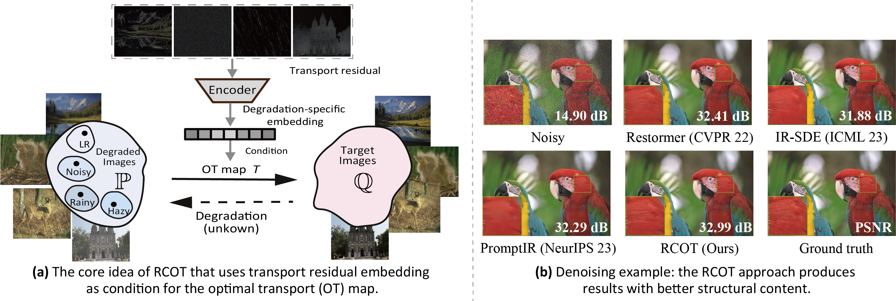

# Residual-Conditioned Optimal Transport (RCOT)
[](https://arxiv.org/pdf/2405.02843)

<hr />

> **Abstract:** *Deep learning-based image restoration methods generally struggle with faithfully preserving the structures of the original image.  In this work, we propose a novel Residual-Conditioned Optimal Transport (RCOT) approach, which models image restoration as an optimal transport (OT) problem for both unpaired and paired settings,  introducing the transport residual as a unique degradation-specific cue for both the transport cost and the transport map. Specifically, we first formalize a Fourier residual-guided OT objective by incorporating the degradation-specific information of the residual into the transport cost. We further design the transport map as a two-pass RCOT map that comprises a base model and a refinement process, in which the transport residual is computed by the base model in the first pass and then encoded as a degradation-specific embedding to condition the second-pass restoration. By duality, the RCOT problem is transformed into a minimax optimization problem, which can be solved by adversarially training neural networks. Extensive experiments on multiple restoration tasks show that RCOT achieves competitive performance in terms of both distortion measures and perceptual quality, restoring images with more faithful structures as compared with state-of-the-art methods.* 
<hr />

This is the official `Python` implementation of the [ICML 2024](https://icml.cc/) paper [**Residual-Conditioned Optimal Transport: Towards Structure-Preserving Unpaired and Paired Image Restoration**](https://arxiv.org/pdf/2405.02843).

The repository contains reproducible `PyTorch` source code for computing **residual-conditioned optimal transport** (RCOT)  map for structure-preserving and degradation-aware restoration.
The key idea is to **integrate the transport residual as a degradation-specific cue into the transport cost, and more crucially, into the transport map via a two-pass conditioning mechanism**.
<p align="center"></p>
<p align="center"></p>


##  Setup
This repository is built in PyTorch 2.1.1 and tested on Ubuntu 18.04 environment (Python3.8, CUDA11.8). For super-resolution, the LR images undergo bicubic rescaling to match the dimensions of their respective high-resolution counterparts.
Follow these instructions.
###  Dependencies Installation


1. Clone our repository
```
git clone https://github.com/xl-tang3/RCOT.git
cd RCOT
```

2. Create conda environment
The Conda environment used can be recreated using the env.yml file
```
conda env create -f env.yml
```

or


```
conda create -n RCOT python=3.8
conda activate RCOT
conda install pytorch==2.1.1 torchvision==0.16.1 torchaudio==2.1.1 pytorch-cuda=11.8 -c pytorch -c nvidia
pip install scikit-image
pip install einops
pip install h5py
pip install opencv-python
pip install tqdm
pip install lpips
pip install matplotlib
```

###  Dataset Download and Preperation

All the datasets used in the paper can be downloaded from the following locations:

Denoising: [BSD400](https://drive.google.com/file/d/1idKFDkAHJGAFDn1OyXZxsTbOSBx9GS8N/view?usp=sharing), [WED](https://drive.google.com/file/d/19_mCE_GXfmE5yYsm-HEzuZQqmwMjPpJr/view?usp=sharing), [Kodak24]([https://drive.google.com/drive/folders/1B3DJGQKB6eNdwuQIhdskA64qUuVKLZ9u](https://www.kaggle.com/datasets/drxinchengzhu/kodak24/data))

Deraining: [Train100L&Rain100L](https://drive.google.com/drive/folders/1-_Tw-LHJF4vh8fpogKgZx1EQ9MhsJI_f?usp=sharing)

Dehazing: [RESIDE](https://sites.google.com/view/reside-dehaze-datasets/reside-v0) (SOTS)

Super-Resolution: [DIV2K x4](https://data.vision.ee.ethz.ch/cvl/DIV2K/)

The training data should be placed in ``` data/Train/{task_name}``` directory where ```task_name``` can be Denoise, Derain, Dehaze or any single degradation.
After placing the training data the directory structure would be as follows:
```
└───Train
    ├───Dehaze
    │   ├───original
    │   └───synthetic
    ├───Denoise
    └───Derain
        ├───gt
        └───rainy
    └───single
    │   ├───degraded
    │   └───target
```

The testing data should be placed in the ```test``` directory wherein each task has a separate directory. The test directory after setup:

```
└───Test
    ├───dehaze
    │   ├───input
    │   └───target
    ├───denoise
    │   ├───bsd68
    │   └───kodak24
    └───derain
    │   └───Rain100L
    │        ├───input
    │        └───target
```
### Training 
We have uploaded  the training code  of the newest version, in which the previous backbone MPRNet is replaced by Restormer, yielding better performance than previous versions.

#### Deraining

```
python trainer.py --batchSize=3 --nEpochs=51 --pairnum=10000000 --Sigma=10000 --sigma=1 --de_type derain --type Deraining --patch_size=128  --gpus=0
```

#### Dehazing

```
python trainer.py --batchSize=3 --nEpochs=51 --pairnum=10000000 --Sigma=10000 --sigma=1 --de_type dehaze --type Dehazing --patch_size=128  --gpus=0
```
#### Denoising with sigma=50

```
python trainer.py --batchSize=3 --nEpochs=51 --pairnum=10000000 --Sigma=10000 --sigma=1 --de_type denoise_50 --type Dehazing --patch_size=128  --gpus=0
```
#### For any degradation, you just need to put the LQ and HQ images in folders single/degraded and single/target and run:

```
python trainer.py --batchSize=3 --nEpochs=51 --pairnum=10000000 --Sigma=10000 --sigma=1 --de_type single --type single --patch_size=128  --gpus=0
```

###  Pretrained Weights

We provided the [weights](https://drive.google.com/drive/folders/16-D1VHGLlkK3DShQVBsDN2WyumlK0jSi) of original version with MPRNet as the backbone.


Contact me at Sherlock315@163.com if there is any problem.

## Citation
```
@inproceedings{
	tang2024residualconditioned,
	title={Residual-Conditioned Optimal Transport: Towards Structure-Preserving Unpaired and Paired Image Restoration},
	author={Xiaole Tang and Xin Hu and Xiang Gu and Jian Sun},
	booktitle={International Conference on Machine Learning (ICML)},
	year={2024},
	pages={47757--47777},
	organization={PMLR}
}
```


